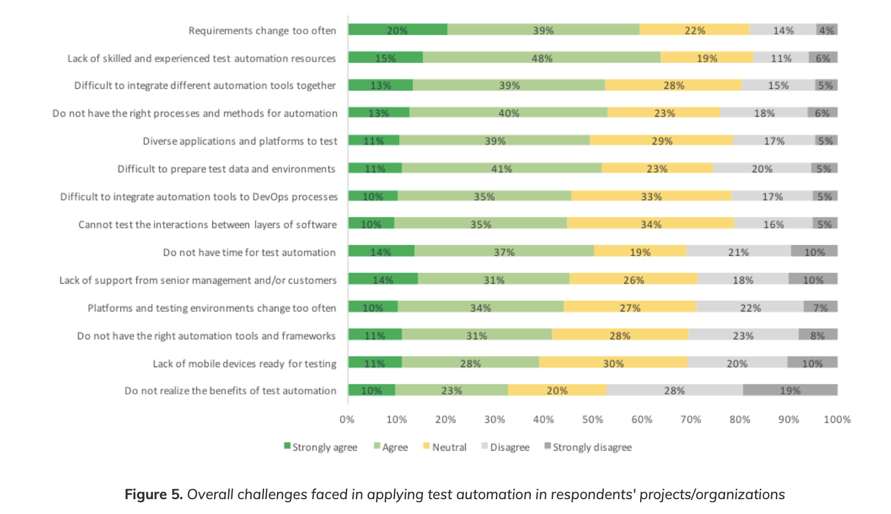
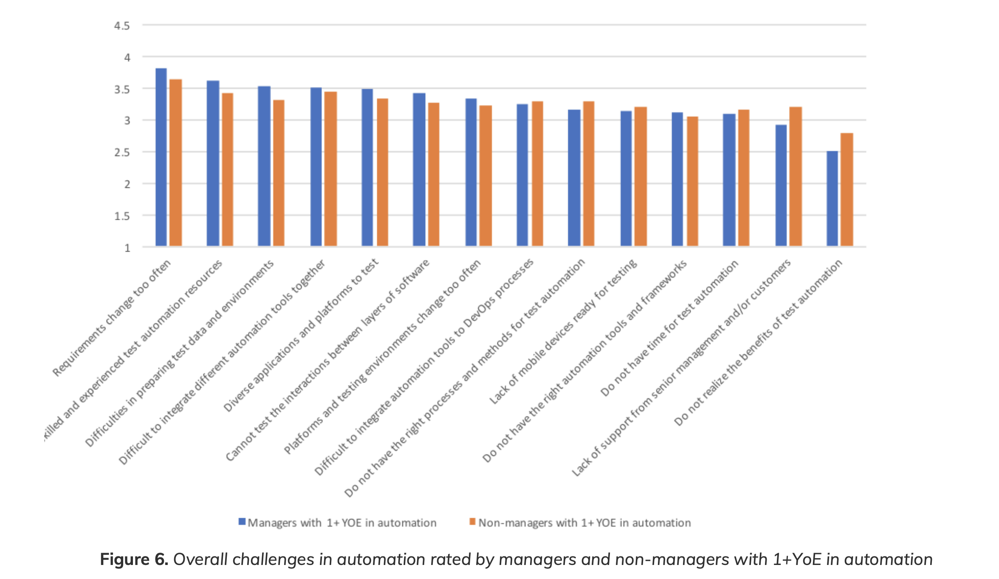
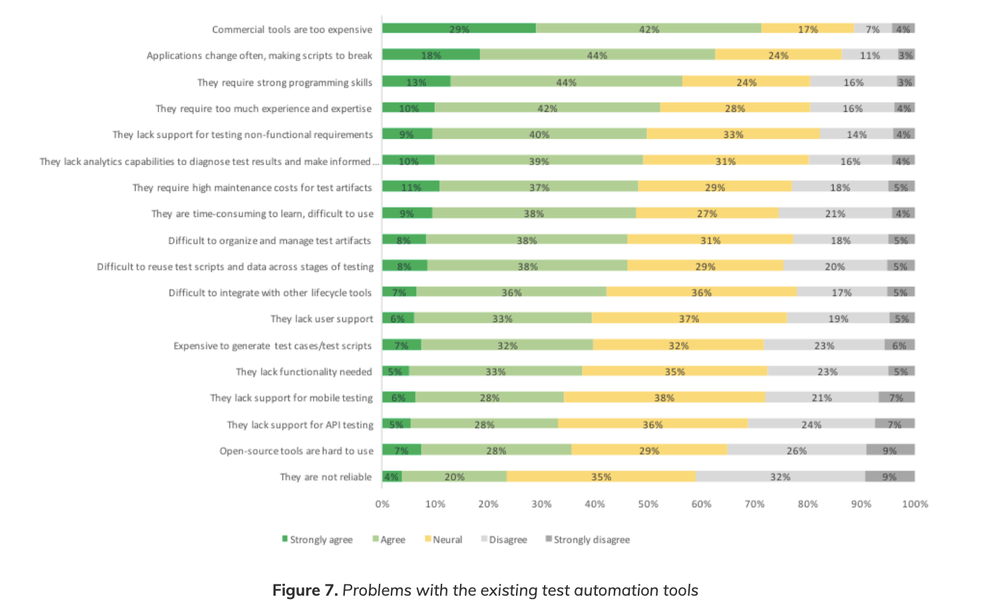
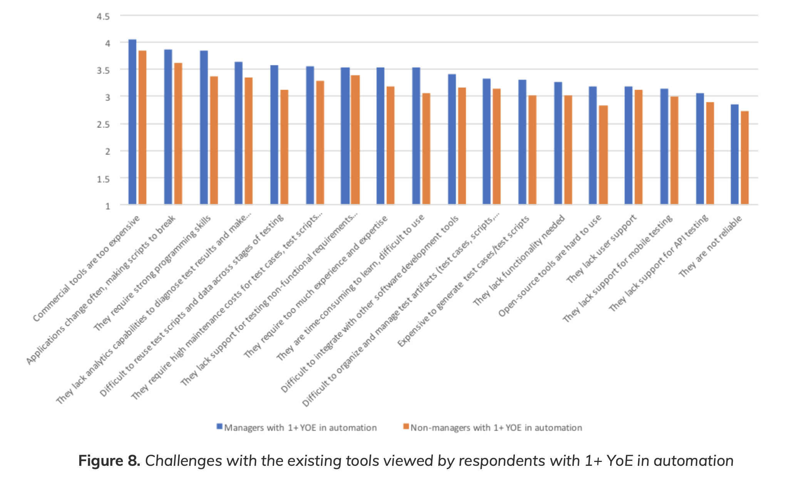
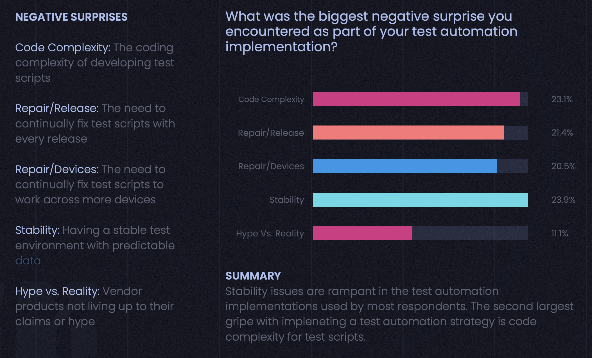
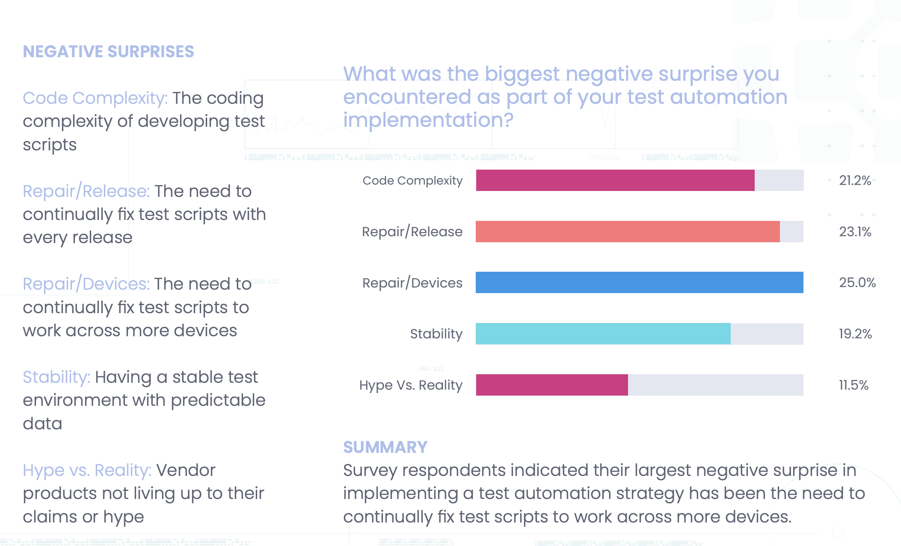
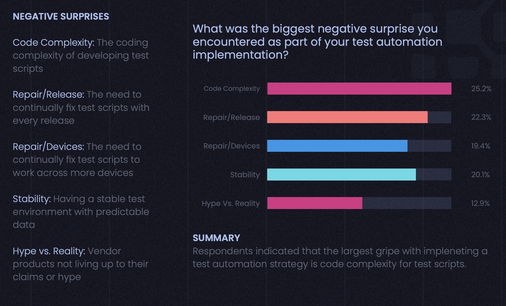
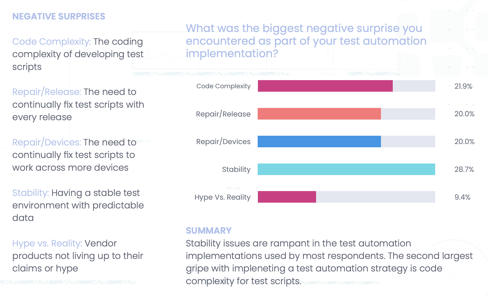
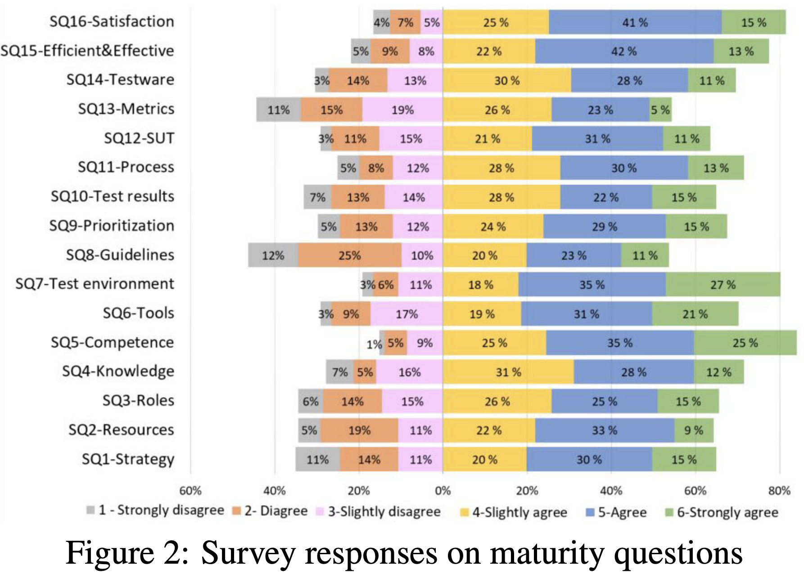
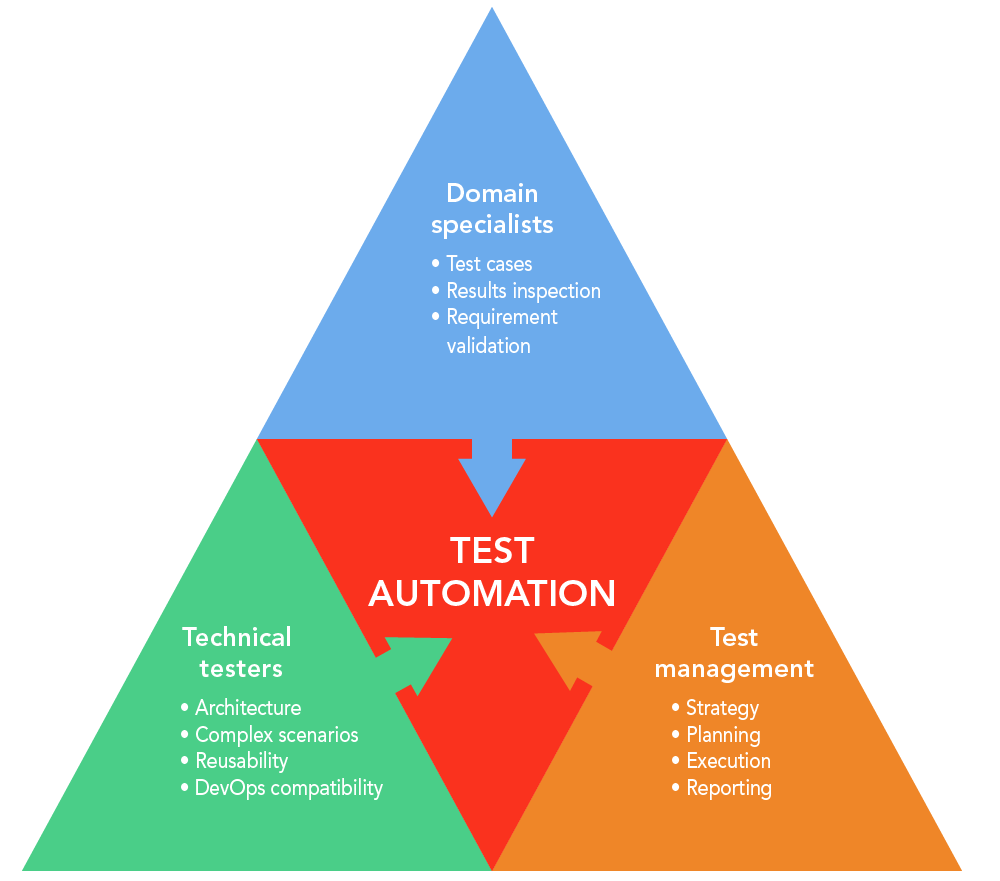

# bugcafe-data-prep-for-automation-test

## Why Automation Test Failed

Lead to prepare data

### Reference (Why Automation Test Failed)

1. [22 Reasons Why Test Automation Fails For Your Web Application](https://dzone.com/articles/22-reasons-why-test-automation-fails-for-your-web#:~:text=The%20sequential%20execution%20of%20test,can%20cause%20unintended%20code%20interactions.)

    - Manually Setting up the Test Environment Before Executing Every Test Automation Suite (19)
        The primary purpose of automation testing is to minimize the stress involved in repetitive manual testing, in order to save time. On an abstract level, it sounds good but for those who perform test automation, realize the struggle in configuring the right infrastructure for performing in-house test automation. I have often observed testers refreshing the entire test automation suite before executing a new script to avoid any ambiguity with scripts. But that fails the entire point of automation testing, doesn’t it?

    - Running Multiple Test Suites on a Static Test Environment Repeatedly Without Cleaning (20)
        This is a very common reason why test automation fails for your organization. Especially, when deadlines are near. Your test department continues to run numerous test suites over the same test environment, without clearing the cache of the previously executed test automation scripts. That may lead to faulty test evaluation, your test reports may get compromised as you encounter more false negatives and false positives.

        For instance, say you need to test your web-applications for different geographies. While performing geolocation from a static test environment. There is a possibility that your script may encounter a test from Google asking you to prove that you are not a bot. This would lead to the failure of the test automation script.

    - The Test Environment Itself Is Buggy
        To make automation work across different test environments, there is a great deal of planning involved. You need to test on staging environments to ensure the code works flawlessly when moved into the production pipeline; however, it happens many times that your test automation script for a code change, when tested in Stage environment, works seamlessly but when moved to Production, it falls apart. There could be many reasons behind such issues such as lack of constant monitoring, Staging environment failing to twin the Production environment, absence of live traffic and more.

2. [Why Test Automation Fails? Top Reasons (+ Solutions)](https://www.lambdatest.com/blog/automation-testing-failure/)

    - Insufficient Test Data Set
        In many scenarios, test automation will be used on systems where manual testing is already taking place. This is definitely a good start to test automation, but to increase the throughput of test automation, you may sooner or later move to an advanced infrastructure where tests can be executed in parallel. This also means that the minimal data set that your test team used for manual testing should be enhanced so that different aspects of product implementation can be tested. You do not want to miss verifying a corner test scenario and receive flak from your customers! Negative ratings from your customers can damage the product’s brand value.

        Instead of refreshing all the test data that your team accumulated during manual testing, it is recommended to scale the test data set. For example, for a simple login screen, the test data set can be combined with different types & sizes of user-name/password combination. You need to build the test data from an end-consumer/customer’s mindset. A test automation scenario that might look trivial to you may turn out to be an important one!

        There are frameworks like Hypothesis that can provide you a range of test values to verify your test cases/test suites. Such kind of frameworks can be used in conjunction with Selenium test automation or any other test automation framework of your choice. A minimal test data set would mean less stress on the test automation tool/test automation system, resulting in less ROI from test automation. Usage of in-house or cloud-based test automation infrastructure comes at a cost. Getting minimal ROI due to less use of that infrastructure will definitely result in automation testing failures.

    - Keeping Data Sets And Test Suit Separate
        We stressed the importance of modular & maintainable test suite/test code to avoid automated testing problems in one of the earlier points. A website/web application will have a user interface through which the users will use different features on the website/application. The end-user is not even slightly bothered about what lies under the hood since the only thing exposed to them is the user interface.

        Whether your product is in the MVP (Minimum Viable Product) phase or an advanced phase, it would definitely involve exponential user interface changes. These changes would be to improve the overall user experience. What if the test code is tightly coupled with the web element locators? What if there is a change in the name of the web element? Such design change can either create havoc within the test automation team or accept the change calmly. It all depends on the test code’s overall structure; this also includes the directory structure where the test suite file is located.

        The development of test cases should not be kept separate from actual product development. The product development team needs to have regular communication with the test team. Developers can even participate in code reviews so that the overall quality of the test code is improved. Changes in elementIDs (XPath, link text, link-id, etc.) should not significantly impact the test code. The only possible scenario for this is if there is a clear bifurcation between the test data, web element locators, and test suite. Selenium automation testing is viral for test automation; choosing the right framework can ease out that process.

        If web element locators are maintained in a separate file, any UI changes will only involve changes in that file without any change in the test suite/test code. Following such a modular approach will reduce the code maintainability time, thereby freeing critical resources to take up some other vital tasks.

3. [The most striking problems in test automation: A survey May 2018](https://d1h3p5fzmizjvp.cloudfront.net/wp-content/uploads/2018/06/05101901/The-Most-Striking-Problemns-in-Test-Automation-A-Survey.pdf) [Downloaded Files](./resources/The-Most-Striking-Problemns-in-Test-Automation-A-Survey.pdf)

    - Overall challenges in test automation

        Figure 5 shows the items rated by all respondents as the possible challenges faced when adopting test automation in their projects/organizations. The items are ranked by their weighted averages using a five-level scale ranging from “strongly disagree“ as 1 to “strongly agree” as 5.

        

    - Respondents with 1+ YoE in automation had a different view on challenges

        The figure below shows the challenges ranked by managers (project managers, senior managers, and test managers) and non-managers who have at least one YoE in automation. The rankings by these respondents are quite similar to those of all respondents except a few differences. Rapid changing in requirements and the lack of skilled and experienced resources are still the top two challenges rated. `But those with 1+ YoE valued the preparation of test data and environments over the other remaining challenges including the lack of right processes and methods for automation (which is not ranked high compared with other challenges).`

        Both non-managers and managers agreed on the same set of top five challenges, but managers tend to value these challenges higher than non-managers. About 61% of managers agreed or strongly agreed that rapidly changing requirements posed a real challenge for automation.

        

    - Challenges and problems with the existing automation tools

        A right set of automation tools is necessary for successful test automation adoption. It allows organizations to successfully implement testing strategies and realize the full benefit of test automation. To understand professionals’ perceptions about the existing test automation toolset that they have, in the questionnaire, we asked respondents about challenges or problems that they had with the existing test automation toolsets used in their projects and organizations.

        

    - Lack of analytics capabilities and difficulty to reuse test scripts and data

        Respondents with 1+ YoE in automation evaluated differently for the top challenges/problems with the existing tools from all respondents as shown in Figure 8. Although identifying the same top three challenges, they ranked the lack of analytics capabilities to diagnose test results and the difficulty to reuse test scripts and data among the top five, representing quite a different view compared with all respondents. This finding reflects that fact that few automation solutions now can address these problems.

        As shown in Figure 8, managers and non-managers have a quite different view as managers had a higher level of consensus on the challenges than did non-managers. Managers were more concerned with the tools’ level of programming skills required than were nonmanagers. More non-managers agreed that the lack of support for testing non-functional requirements is a challenge than they did for test script reuse, which is highly ranked by managers. It is worth differentiating the perspectives of these two roles, as managers tend to be concerned with a high-level perspective such as cost, support and maintenance services while non-managers are more concerned with learning, documentation, functionality of the tools.

        

4. [State of Test Automation 2020-2021](https://info.kobiton.com/test-automation-2020-survey) [Downloaded Files](./resources/State-of-Test-Automation-2020-2021-Edition-An-Industry-Survey-by-Kobiton.pdf)

    - NEGATIVE SURPRISES

        1. Code Complexity: The coding complexity of developing test scripts

        2. Repair/Release: The need to continually fix test scripts with every release

        3. Repair/Devices: The need to continually fix test scripts to work across more devices

        4. Stability: Having a stable test environment with predictable data

        5. Hype vs. Reality: Vendor products not living up to their claims or hype

        

        `SUMMARY`

        Stability issues are rampant in the test automation
        implementations used by most respondents. The second largest
        gripe with impleneting a test automation strategy is code
        complexity for test scripts

        The biggest negative surprises for test automation among small and midsize companies are all related to coding complexity, likely due to their limited access to top talent. In contrast, large enterprises with virtually unlimited capital to deploy on people and tools worry most about maintaining stable test environments where data is predictable and reliable.

        `by Company Size`

        The biggest negative surprises for test automation among small and midsize companies are all related to coding complexity, likely due to their limited access to top talent. In contrast, large enterprises with virtually unlimited capital to deploy on people and tools worry most about maintaining stable test environments where data is predictable and reliable.

        - COMPANY SIZE 50-100 EMPLOYEES

            

        - COMPANY SIZE 100-500 EMPLOYEES

            

        - COMPANY SIZE > 500 EMPLOYEES

            

5. [Software Test Automation Maturity - A Survey of the State of the Practice](https://arxiv.org/pdf/2004.09210.pdf) [Downloaded File](./resources/Software-Test-Automation-Maturity-A Survey-of-the-State-of-the-Practice.pdf)

    - RQ2 – Practice maturity.

        Figure 2 shows the overview of responses to test automation maturity questions in part 2 of our survey. Agreed responses (i.e., who rate 4-6 from slightly agree to strongly agree) are stacked to the right of a vertical baseline on ‘0%’ on the x-axis. Disagreed responses (i.e., who rate 1-3 from strongly disagree to strongly agree) are stacked to the left of the same baseline. Note that since ‘no answer’ exists for a certain survey question, the total percentage of all agreed responses and disagreed responses may be not equal to 100%.

        K06 (Test environment) : Set up test environment with required software, hardware, test data, etc., to execute automated tests

        

        The percentage of agreed responses on each question is in the range of 54% (N=82) to 85% (N=128). It may be noted that the situation is quite diverse with respect to different practices. We further compared the percentage of agreed responses and disagreed responses, in order to know which practices are more mature and immature in the industry: ‘SQ5-Competence’ has the largest percentage (85%) of agreed responses, suggesting that, 85% of responses agreed that their test team has enough expertise and technical skills for test automation. Besides, `‘SQ7-Test environment’ and ‘SQ16-Satisfaction’ also have more than 80% agreed responses. This indicates that the majority of responses agreed that they have the control over configuration of their test environment, and their automated tests can meet the given test purposes and bring substantial benefits.`

## Test Data Management

for functionall and non-functional test

1. Accelerate

    - Chapter 4 Technical Practices - TEST DATA MANAGEMENT

        When creating automated tests, managing test data can be hard. In our data, successful teams had adequate test data to run their fully automated test suites and could acquire test data for running automated tests on demand. In addition, test data was not a limit on the automated tests they could run.

2. [Martin Fowler - Evolutionary Database Design](https://www.martinfowler.com/articles/evodb.html)

    - Everybody gets their own database instance

        Most development organizations share a single development database, which is used by all members of the organization. Perhaps a separate database is used for QA or staging, but the notion is to limit how many databases are running live. Sharing databases like this is a consequence of database instances being difficult to set up and manage, leading organizations to minimize how many there are. Controls on who can alter the schema in such situations varies, some places require all changes to be made through the DBA team, others allow any developers to change the schema of the development database, and the DBAs get involved when changes are promoted downstream.

3. Continuous Integration: Improving Software Quality and Reducing Risk - Chapter 5. Continuous Database Integration

    - Automate Database Integration
    - Use a Local Database Sandbox
    - Use a Version Control Repository to Share Database Assets
    - Continuous Database Integration
    - Give Developers the Capability to Modify the Database
    - The Team Focuses Together on Fixing Broken Builds
    - Make the DBA Part of the Development Team
    - Database Integration and the Integrate Button

    - Summary
        This chapter demonstrated that database assets are the same as other source code. Therefore, the same principles apply.

        Automate your database integration using orchestrated build scripts that are run continuously, after any change to your database or its source code.

        Ensure a single source for database assets by placing them in a version control repository.

        Test and inspect your database scripts and code.

        Change database development practices by ensuring that all database integration is managed through the build scripts, that all database assets are checked into version control, and that all developers (who interact with the database) have a database sandbox.

4. Continuous Delivery: Reliable Software Releases through Build, Test, and Deployment Automation - Chapter 12. Managing Data

    Data and its management and organization pose a particular set of problems for testing and deployment processes for two reasons. First, there is the sheer volume of information that is generally involved. The bytes allocated to encoding the behavior of our application—its source code and configuration information—are usually vastly outweighed by the volume of data recording its state. Second is the fact that the lifecycle of application data differs from that of other parts of the system. Application data needs to be preserved—indeed, data usually outlasts the applications that were used to create and access it. Crucially, data needs to be preserved and migrated during new deployments or rollbacks of a system.

    - DATABASE SCRIPTING
    - INCREMENTAL CHANGE
    - MANAGING TEST DATA
    - DATA MANAGEMENT AND THE DEPLOYMENT PIPELINE

5. [Test Data Management: Drive DevOps efficiency](https://www.informatica.com/products/data-security/test-data-management.html)

6. [What is Test Data Management?](https://www.informatica.com/services-and-training/glossary-of-terms/test-data-management-definition.html)

    Test data management is the creation of non-production data sets that reliably mimic an organization’s actual data so that systems and applications developers can perform rigorous and valid systems tests.

    - What do I need to know about test data management?
        The quality of test data matters. If applications are tested against generic data many problems can arise once the application is put into production. To avoid problems, applications must be tested rigorously against data that is as similar as possible to the actual data that will be used.

    - Why not copy production data for tests?

        Production data is often not practical for use in a test system due to security and regulatory concerns. Data that has personally identifiable information must be altered in order to protect people from having sensitive data exposed to the development and testing teams. Test data management uses data masking techniques to obfuscate personally identifiable information while still retaining the formatting and other data properties that are important for testing.

    - Who uses test data management?

        Test data management is used by organizations that do a lot of business critical processing of sensitive data. It is especially important in industries such as health care where a breach of sensitive customer data could be extremely damaging. However, most organizations have some data that is sensitive and needs to be masked for testing purposes.

    - What are the benefits of test data management?

        Test data management helps organizations create better quality software that will perform reliably on deployment. It prevents bug fixes and rollbacks and overall creates a more cost-efficient software deployment process. It also lowers the organization’s compliance and security risks.

7. [Informatica Test Data Management](https://www.informatica.com/content/dam/informatica-com/en/collateral/data-sheet/informatica-test-data-management_data-sheet_3234en.pdf)

8. [Informatica Secure Testing Solution](https://www.informatica.com/content/dam/informatica-com/en/collateral/solution-brief/informatica-secure-testing-solution_solution-brief_3656en.pdf)

9. [Test Data Management: What This Means and 3 Tools to Use](https://www.plutora.com/blog/test-data-management)

    Test Data Management (TDM) is the administration of the data necessary for fulfilling the needs of automated test processes. TDM should also ensure the quality of the data, as well as its availability at the correct time.

10. [Test Data Management (TDM): A Complete View](https://medium.com/mathematicallygifted/tdm-test-data-management-a-complete-view-42a743db9008)

11. [Qualitest - Test Data Management: An Overview](https://www.qualitestgroup.com/white-papers/test-data-management-overview/)

12. [Test Data Management Reinvented](https://www.delphix.com/solutions/test-data-management)

13. [3 highly effective strategies for managing test data](https://techbeacon.com/app-dev-testing/3-highly-effective-strategies-managing-test-data)

## Test Automation

All members of a test team, incl. domain specialists, technical testers, and test management play an important role in making test automation work.

### Reference (## Data Management)

- [DevOps tech: Test data management](https://cloud.google.com/solutions/devops/devops-tech-test-data-management)

## Initial Database

### 2 Ways

- Data Test within Migration
- Seperate Data Test from Migration

## Data Migration

## Data Test Seeding

## Key of Automation

- Repeatable
- Atomicity

## Other Link

- [Test Automation Strategy Checklist](https://cdn2.hubspot.net/hubfs/2912187/LEAPWORK-FactSheet-TestAutomationStrategy-Checklist.pdf?utm_campaign=Test%20Automation%20Strategy&utm_medium=email&_hsmi=74450537&_hsenc=p2ANqtz-_fnhJcjUbqAPLkuimcMzH-3CoVj-r1ddeFXCG_V4CrbnjqzrvVrCXyblQlY3N34rGiUFxbnsIYdnK4JlbvOOEjr2Xleg&utm_content=74450537&utm_source=hs_automation)
